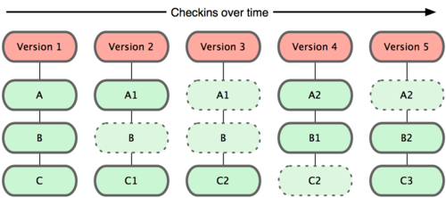

# Git과 GitHub를 사용한 소프트웨어 개발

<br>

 

<br>

### Git과 GitHub 기본 사용법, Git GUI 도구 사용법, 팀 프로젝트 관리
##### [PPT 파일](https://github.com/Iyeonghun/Git_Document/blob/master/Git과%20Github를%20사용한%20소프트웨어개발.pdf)
##### Created by 이영훈 ( [@iyeonghun](https://github.com/iyeonghun) )

## 목차
- **Ch1. Git, Basic**
- **Ch2. Git, Remote repositories**
- **Ch3. Git, Branches**
- **Ch4. Git, Advanced**
- **Ch5. GitHub**
- **Ch6. Android Studio Git Client**
- **Ch7. Practice Git**

## Ch1. Git, Basic
- Introduce Git 
- Installing & Configuring Git
- Creating a new repository
- Checking the status
- Staging
- Commiting

### Introduce Git
Git은 소스코드 관리를 위한 **분산 버전 관리 시스템** 이다.
분산 버전 관리 시스템이란 파일의 스냅샷(버전)들을 전부 복제해 두는 것으로 서버에 문제가 생겨도 이 복제물로 작업을 시작하거나 서버를 복원 할 수 있다.

 
> 중앙집중식 버전 관리 시스템과 분산 버전 관리 시스템 다이어그램

### Introduce Git
#### Git의 핵심
1. 델타가 아니라 스냅샷
파일에 대한 변화(델타)를 저장하는 것이 아니라 시간순으로 스냅샷을 저장
 

2. 대부분 명령을 로컬에서 실행
거의 모든 명령이 로컬 파일과 데이터만을 사용하기 때문에 네트워크에 있는 다른 컴퓨터(서버)는 필요가 없다.
오프라인 상태에서도 소스코드를 비교하고 Commit 할 수 있다.

### Introduce Git
#### Git의 핵심
3. 세가지 상태 및 단계
	1. Committed - 데이터가 로컬 데이터베이스에 안전하게 저장되었다.
	2. Modified - 수정한 파일을 아직 Commit 하지 않았다.
	3. Staged - 수정한 파일을 곧 Commit 할거라고 표시하였다

	

	1. Working Directory - 프로젝트의 특정 버전을 Checkout 한것 
    2. Staging Area - 단순한 파일로 곧 Commit할 파일에 대한 정보를 저장
    3. Repository - 프로젝트의 메타데이터와 객체 데이터베이스를 저장하는 곳
    	1. `git init` 혹은 저장소를 Clone 할때 만들어진다.

### Introduce Git
#### Git의 핵심
4. 무결성
모든 데이터를 저장하기 전에 해시을 구하고 이 해시로 데이터를 관리하며 SHA-1 해시를 사용하는데 아래와 같이 생겼다.
`24b9da6552252987aa493b52f8696cd6d3b00373`
모든 것을 해시로 식별 하기 때문에 여기저기서 보이며 실제로 Git은 파일을 이름으로 저장하지 않고 해당 파일의 해시로 저장한다.

5. 데이터를 추가만 한다
Git은 항상 데이터를 추가하며 되돌리거나 데이터를 삭제할 방법이 없다.
	> 로컬에서 파일을 삭제하면 버전관리 대상이 아닌 파일로 인식한다.

### Introduce Git
#### Git으로 할 수 있는 것
- 아이디어를 실험하기 위해 브랜치를 만들고, 몇 번 커밋을 하고, 원래 것으로 돌아가, 패치를 적용한다. 다시 실험중인 브랜치로 돌아가 그것을 머지한다.
- 제품으로 출시하기 위한 브랜치는 하나만 가질 수 있지만 그외 다른 목적의 브랜치는 마음것 만들 수 있다. 테스트나 일상적인 업무를 위한 브랜치를 만들어 작업하고 그 것을 머지한다.
- 당신이 만들고 있는 이슈마다 브랜치를 새로 만들고 그 브랜치들 사이들 오가며 작업할 수 있다. 그리고 그 브랜치를 마스터 브랜치로 머지한 후에 그 브랜치들을 삭제한다.
- 실험용 브랜치를 만들고 쓸모가 없으면 바로 삭제한다. (그 동안 다른 브랜치들을 푸시했었더라도) 실험은 버려졌기 때문에 아무도 모른다.

### Installing & Configuring Git

Git을 운영체제 별로 아래와 같이 다운받아 설치 한다.
- Windows - https://git-scm.com
	
- Linux - 터미널에 다음 커맨드를 입력한다. 
	- Ubuntu : `sudo apt-get install git`
	- CentOS : `sudo yum -y install git`
- macOS - 설치 되어 있음 

### Installing & Configuring Git

Git 설치 이후 가장 먼저 사용자 이름과 이메일 주소를 설정 해야한다.
Commit을 할 때마다 이 정보를 사용한다.
Git 터미널에 아래 커맨드를 입력한다.
```
$ git config --global user.name "이름"
$ git config --global user.email 이메일@example.com
```
> 한번 Commit 한 후에는 정보를 변경 할 수 없다.

> 만약 프로젝트마다 다른 정보를 사용하고 싶으면 위 커맨드에서 
> `--global` 옵션을 제외한다.

### Creating a new repository
기존 프로젝트를 Git으로 관리 하기 위하여 프로젝트의 디렉토리로 이동해서
아래와 같은 커맨드를 실행한다.
```
$ cd Desktop/git_exercise/ << 프로젝트의 루트 디렉토리로 이동
$ git init
```
> 바탕화면에 임의로 git_exercise 라는 폴더를 생성 하였다.

이 커맨드는 `.git`라는 하위 디렉토리를 만든다.
`.git` 디렉토리에는 저장소에 필요한 뼈대파일이 들어있다.

### Checking the status
현재 프로젝트의 파일 상태를 확인하려면 `git status` 커맨드를 사용하며, 이 커맨드를 사용하여 파일의 수정 상태와 파일의 Track상태를 확인한다.
Untracked 상태라면 스냅샷(Commit)에 넣어지지 않은 파일이기 때문에 Git은 절대로 그 파일을 Commit하지 않는다.
```
$ git status
On branch master
Initial commit

Untracked files:
  (use "git add <file>..." to include in what will be committed)

	hello.txt

nothing added to commit but untracked files present (use "git add" to track)
```
> git_exercise 디렉토리에 임의로 hello.txt 파일을 생성 하였다.

### Staging
Git은 Staging area를 가지고 있으며 이는 빈 캔버스라고 생각할 수 있다. 
빈 캔버스는 Commit하고자 하는 변경 사항을 기록 하고 있는데 이 공간에 변경 사항을 기록하기 위해서 `git add` 커맨드를 사용한다. 
```
$ git add hello.txt
$ git status
On branch master

Initial commit

Changes to be committed:
  (use "git rm --cached <file>..." to unstage)

	new file:   hello.txt
```
> 위와같이 특정 파일을 추가 할 수도 있으며 `git add .`혹은 `git add -A`를 사용하여 모든 변경 사항을 한번에 등록 할 수도 있다. 

### Commiting
Commit은 특정 시점의 저장소 상태를 나타내는 것으로 스냅샷이라고 할 수 있다.
언제든지 돌아갈 수 있는 특정 지점을 생성한다고 볼 수 있으며 새로운 Commit를 생성하려면 최소한 하나의 변경 사항이 Staging area에 추가 되어야 한다.
Commit을 하기 위한 커맨드는 아래와 같다.
```
$ git commit -m "commit에 대한 설명을 작성"
```
> Commit을 자주 하는 것이 있으며 Commit에 대한 설명은 다른사람이 알아볼 수 있게 작성 하는 것이 좋다.

## Ch2. Git, Remote repositories
- Connecting to a remote repository
- Uploading to a server
- Cloning a repository
- Getting changes from a server

### Connecting to a remote repository
프로젝트의 모든 스냅샷을 원격 저장소에 업로드 하여 관리하기 위해서는 Github, Gitlab, Bitbucket 등의 서비스에 연결 하여야 한다.
원격 서비스에 연결하기 위해서는 아래와 같은 커맨드를 사용한다.
```
$ git remote add origin 원격 저장소 주소 
```
> 프로젝트에는 여러 원격 저장소가 연결 될 수 있으며 이를 구분하기 
> 위해서 다른 이름으로 등록 하여야 하고 이 때는 `origin`을 수정한다.

> 주요 원격 저장소의 이름은 **origin**으로 쓰는것이 기본이다.

### Uploading to a server
원격 저장소와 연결을 하였다면 로컬에서 작업한 Commit을 서버로 전송해야 한다.
이는 **Push**라고 하며 원격 저장소를 업데이트 할 때마다 수행한다.
이와 같은 기능을 위한 커맨드는 아래와 같으며 두개의 매개변수를 가지고 있다.
```
$ git push origin master
```
> origin : 원격 저장소 이름 // master : branch 이름

> 사용중인 원격 저장소 서비스에 따라 인증이 필요할 수도 있다.

### Cloning a repository
자신 혹은 다른 사람의 원격 저장소에 있는 Repository를 가져와 사용할 수 있으며 아래 명령어를 통하여 로컬에서 다운로드하여 프로젝트의 전체 복사본을 만들 수 있다.
```
$ git clone 원격 저장소 주소
```
> git Repository를 생성하는데 `git init`를 하지 않아도 되며 원격 저장소와 동일한 로컬 Repository가 자동으로 생성된다.

### Getting changes from a server
두개 이상의 로컬에서 같은 프로젝트를 작업 하기 위하여 매번 `clone` 할 필요가 없다.
원격 저장소에 **Push**를 하였다면 **Pull** 커맨드로 변경 사항을 다운로드 할 수 있다.
**Push**와 같이 두개의 매개변수를 가지고 있다.
```
$ git pull origin master
```
> origin : 원격 저장소 이름 // master : branch 이름

> 사용중인 원격 저장소 서비스에 따라 인증이 필요할 수도 있다.

## Ch3. Git, Branch
- Introduce Branch
- Creating new branch
- Switching branch
- Merging, Removing branch

### Introduce Branch
- Branch란 개발자들이 동시에 다양한 작업을 할 수 있게 만들어 주는 기능이다.

- 독립적으로 작업을 진행하기 위해 만들어진 것으로 각각의 Branch는 다른 Branch의 영향을 받지 않기 때문에 여러 작업을 동시에 진행 할 수 있다.

- 만들어진 Branch는 다른 Branch와 병합(Merge)함으로써, 작업한 내용을 다시 하나의 Branch로 모을 수 있다.


### Creating new branch
모든 Git 프로젝트에서 기본적으로 생성되는 Branch는 **master**이다.

추가적으로 새로운 Branch를 만드려면 아래 커맨드를 사용하여 만들 수 있다.

```
$ git branch 사용자 정의 branch 이름
```
> Branch를 만들었다고 해서 Branch가 전환되는 것은 아니다. 이 시점까지 master branch를 사용하고 있다.

### Switching branch
Branch를 전환하기 전에 현재 생성된 모든 Branch를 확인하고 변경 하여야 어떤 Branch를 사용하는지 정확히 알 수 있다.
```
$ git branch

  new_branch
* master
```
**master**는 현재 Branch로 별표로 표시가 되어있다. 
전 페이지에서 생성한 새로운 Branch로 전환하기 위하여 아래 커맨드를 사용한다.
```
$ git branch new_branch
```

### Merging, Removing branch
**new_branch**에 파일을 추가하고 Commit을 한다.
```
$ git add testBranch.txt
$ git commit -m "New feature add"
```
> testBranch.txt 파일을 임의로 생성하였다.

**new_branch**에 Commit이 되었고 **master**로 전환한다.
```
$ git checkout master
```
프로젝트를 열어보면 **new_branch**에서 testBranch.txt가 보이지 않음을 알 수 있다. 
현재 Branch가 **master**이며 이 Branch에서는 생성되지 않았기 때문이다.
**master**에서도 testBranch.txt파일을 보려면 두개의 Branch를 병합하여야 한다.
```
$ git merge 병합할 Branch 이름
```
> `merge`커맨드는 현재 선택된 Branch에 커맨드에 입력된 Branch를 병합한다.

### Merging, Removing branch
마지막으로 모든 사항이 병합된 **new_branch**는 더이상 필요가 없다면 제거 할 수 있으며 아래 커맨드를 사용한다.
```
$ git branch -d 삭제할 Branch 이름
```

## Ch4. Git, Advanced
- Checking difference commits 
- Setting up .gitignore
- Return to a specific commit
- Resolving Merge Conflicts(병합 충돌)

### Checking difference commits
버전 관리에 있어서 Commit 기록을 확인하는 것은 문제해결을 하는데 도움이 된다.
이전 상태로 돌아가거나, 어떤 파일이 수정되었는지 확인 할 수 있기 때문이다.

아래는 Commit 이력을 확인 할 수 있는 커맨드이다.
```
$ git log
```

`-p` 옵션을 통하여 어떤 파일이 수정되었는지 같이 표시하게 된다. 
```
$ git log -p
```

스냅샷 간의 차이점을 비교하고 싶다면 아래 커맨드를 사용한다.
```
$ git diff 스냅샷id1 스냅샷id2
```

### Setting up .gitignore
프로젝트에서 cache, tmp, lib 등의 커밋 하고 싶지 않은 파일이나 폴더가 있다면 `.gitignore` 파일을 만들어 `git add -A`에 포함이 되지 않도록 할 수 있다.

만드는 법은 다음 순서를 따른다.
1. 수동으로 `.gitignore`라는 텍스트 파일을 만들고 프로젝트 디렉토리에 저장
2. 내부에 무시할 파일, 디렉토리의 이름을 한줄에 하나씩 나열한다.
3. `.gitignore` 파일을 Commit하여 등록한다.
4. 이 후 `.gitignore`에 등록된 파일, 디렉토리는 추가되지 않게 된다.

> libs/ : 줄 끝의 `/` 는 폴더라는 것을 나타내고 하위 폴더 역시 무시한다.

> *.log : `*`는 그 부분에 어떤 것이든 상관없고 앞,뒤 단어만 확인하여 무시한다.

### Return to a specific commit
프로젝트를 진행하던 중에 잘못된 개발로 이전 상태로 돌아가야 하는 경우가 발생 한다면 `reset` 커맨드를 사용하여 특정 상태로 돌아가고 그 상태 까지의 Commit 이력을 삭제 할 수 있다.

우선 log 명령어를 실행하여 이력을 확인한다.
```
$ git log 
commit 5c897704302ca57cdc236ba29d7d57550a8d8490

...

commit d6bac0101f29850ae5b43031d7429660407fc45e
```

돌아가려는 Commit의 아이디를 찾고 아래 커맨드에 입력한다.
```
git reset d6bac0101f29850ae5b43031d7429660407fc45e
```
> 되돌릴 수는 있지만 복잡하기 때문에 Reset 커맨드는 항상 주의해서 사용한다.
 
### Resolving Merge Conflicts(병합 충돌)
두개 이상의 Branch를 사용하게 되면 Merge시 아래와 같은 오류가 발생 할 수 있다.
```text
$ git merge issue3
Auto-merging myfile.txt
CONFLICT (content): Merge conflict in myfile.txt
Automatic merge failed; fix conflicts and then commit the result.
```
이는 각각의 Branch에서 변경한 내용이 같은 파일의 같은 행에 포함되어 있기 때문에 충돌이 있는 부분을 직접 수정해 주어야 한다.

수정 후 Commit하고 Merge하면 정상적으로 작동하는 것을 알 수 있다.

> 같은 파일을 동시에 수정하지 않는것이 안전하다.

## Ch5. GitHub
- Repository 생성
	- Readme
	- gitignore, License
	- Settings
- Branch 생성 및 보기
- Commit history 보기
- Pull request 보기 
- Issue 보기 
- 이 후 사용법

### Repository 생성
회원 가입후 로그인을 하면 나오는 창에서 **New repository**를 클릭한다.

 

Repository의 이름과 설명을 작성한다. 


### Repository 생성
#### Readme

프로젝트에 대한 Readme(설명)파일을 자동으로 생성 해주는 옵션이다.
체크하고 다음 페이지에 나오는 **gitignore, License**도 함께 설정하면 편하다.


### Repository 생성
#### gitignore, License

프로젝트에 맞는 **gitignore, License**파일을 자동으로 생성 가능
모두 맞게 작성 및 설정 하였으면 아래 **Create repository**를 클릭하여 완료한다.

 

### Repository 생성
#### Settings

생성 되었으면 상단의 **Settings**를 클릭하여 아래와 같이 설정 한다.


이제 원격 저장소의 준비가 완료 되었다.

### Branch 생성 및 보기

아래 사진처럼 Branch 버튼을 누르고 명령창에 생성할 이름을 써주면 생성된다.
다른 Branch의 파일을 보려면 그 Branch의 이름을 클릭하면 자동으로 전환 되게 된다.


### Commit history 보기

Repository 메인 페이지에서 **Commit**을 클릭할경우 아래와 같이 모든 Commit history를 볼 수 있다. 

이것은 `git log`와 동일한 기능을 가지고 있다.


### Commit history 보기

Commit history에서 Commit 하나를 클릭할 경우 세부적으로 어떤 파일이 Commit 되었는지 파일의 어느부분이 수정되었는지 볼수 있게 된다.


### Pull request 보기

Pull request란 여러사람이 개발할경우 Branch에서 완료된 작업을 다른 사람이 리뷰하고 master로 `merge`요청을 하기 위해 만들어진 것이다.

일반적으로 master Branch는 안정적으로 돌아가는 버전을 올려두고 실제 개발은 다른 Branch에서 하는 것이 좋다.

master로의 `merge`는 PL혹은 다른 팀원의 리뷰 후에 올리는 것이 추후 오류가 적다. 


### Issue 보기

Issue 기능은 여러가지로 사용될 수 있는데 주로 사용되는 것은 기능에 대한 논의, 버그를 추적, 오류 발생에 대한 내용 등을 작성하고 팀원간의 소통을 위해 사용된다.

 

### 이후 사용법

지금까지 GitHub에서 원격 저장소를 생성하고 대략적인 사용법을 알아보았다.

이제 이 저장소를 `clone`하여 사용하거나 프로젝트가 개발 도중이였다면 `git init`후 원격 저장소 등록을 통해서 사용 할 수 있다.

이 원격 저장소의 주소는 **Clone or download**를 클릭하여 확인 할 수 있다.


## Ch6. Android Studio Git Client
- Android Studio Git 설정
- 원격 Repository 생성 및 연결
- gitignore 설정(Add, Commit)
- Pull

### Android Studio Git 설정
#### VCS > Enable Version Control Integration
- 사용할 version control system을 Git으로 선택한다.


#### File > Settings... > Version Control > Git
- 설치한 Windows용 Git의 실행파일인 Git.exe의 위치를 등록한다.


이후 Test 버튼을 눌러 정상적으로 실행 되는지 확인한다.

### 원격 Repository 생성 및 연결
#### VCS > Import into Version Control > Share Project on GitHub
- 위 메뉴를 선택하면 아래와 같이 GitHub 로그인 창이 나온다.


> Save Password는 꼭 체크 해제 하도록 한다.

### 원격 Repository 생성 및 연결
이 후 GitHub에 새로운 Repository를 만들 수 있는 창이 나오는데 Description에 프로젝트 설명을 쓴 뒤 나머지 항목은 수정하지 않고 Share를 눌러 넘어간다.


### 원격 Repository 생성 및 연결
최초 프로젝트 Add, Commit, Push를 자동으로 실행하는데 이때 아래와 같이 설정 후 OK를 눌러 종료한다.


> 꼭 `.idea`를 체크 해제 한다. (최초 시작 프로젝트인 경우)

### 원격 Repository 생성 및 연결
마지막으로 Push 완료 후 아래와 같은 창이 나올 수 있는데 이 때 **Rember, don't ask again**에 체크 후 **No**를 눌러 창을 종료한다.


> 꼭 No를 누르도록 한다. (필요없는 파일)

### gitignore 설정(Add, Commit)

`.gitignore` 파일을 아래 링크의 code snippet에 적힌대로 수정한다.
https://gist.github.com/Iyeonghun/818018c9a43222e6a3183e5dfd418531

#### VCS > Git > Add
- Add 메뉴를 통해서 변경 파일을 모두 Add 한다. (이 시점에서 변경 파일은 .gitignore 하나 뿐이다.)

#### Commit & Push (  버튼 )

- Commit 메세지를 적고 **Commit and Push**를 눌러 원격 저장소에도 저장한다. 

 

### Pull
두개 이상의 로컬에서 같은 프로젝트를 작업 하기 위하여 원격 저장소에 있는 최신 파일로 업데이트를 해야 한다면  버튼을 눌러 `Pull`할 수 있도록 한다.

- 다음과 같은 창이 나오는데 기본값 상태로 Ok를 눌러 업데이트한다.


## Ch7. Practice Git
### Practice Git
Git은 프로그래밍 언어같은 것이 아닌 소스 관리 **도구**이므로 꾸준히 사용을 해야 익숙해 진다. 기본적인 커맨드를 사용할 수 있게 되었다면 바로 프로젝트에 적용하는 것이 가장 빠르게 Git에 익숙해 질 수 있는 방법일 것이다.

아래는 웹에서 Git을 배울 수 있는 사이트 이다.
- Git Branch 배우기 : 웹 에서 시각화된 스냅샷 트리를 통해서 Branch개념과 기본적인 커맨드를 배울수 있다.
	- http://learnbranch.urigit.com
- Try git : 웹에서 디렉터리와 터미널을 보면서 연습 할 수 있는 사이트 (영문) 
	- https://try.github.io/

<br><br>

## Enjoy using GIT! :+1:

### https://github.com/Iyeonghun/Git_Document

Copyright &copy; 2017 [이영훈](https://github.com/iyeonghun)
